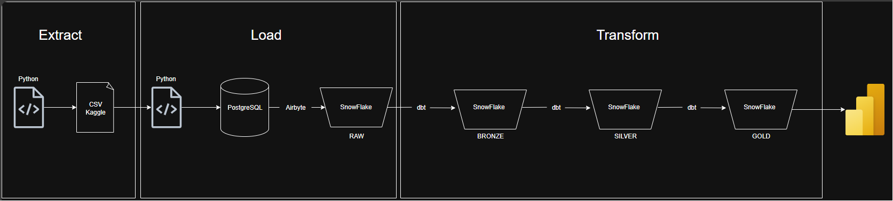
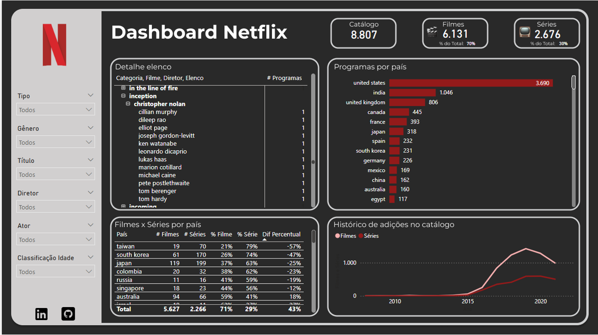
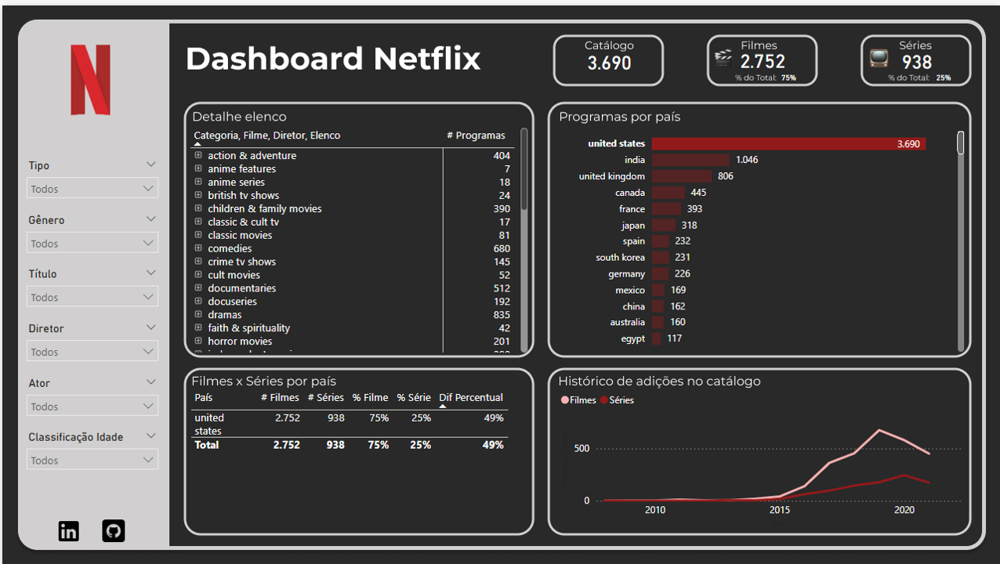

# 🎬 Data Pipeline Netflix – PostgreSQL | Snowflake | dbt | Airbyte | Power BI

Este projeto tem como objetivo **construir um pipeline de dados moderno** utilizando ferramentas amplamente adotadas no mercado de dados, integrando diferentes camadas (bronze, prata e ouro) até a criação de um **dashboard interativo em Power BI**.

O dataset utilizado contém informações sobre o catálogo da Netflix (títulos, diretores, países, gêneros etc.), permitindo a análise do crescimento e da diversidade de produções ao longo dos anos.

---

## 🚀 Tecnologias Utilizadas

- **Python** → Ingestão dos dados e migração pra PostgreSQL
- **Airbyte** → Migração dos dados do PostgreSQL para o SnowFlake
- **Snowflake** → Data warehouse em nuvem
- **dbt (Data Build Tool)** → Transformações SQL e versionamento de modelos
- **Power BI** → visualização e análise de dados
- **GitHub** → versionamento e documentação do projeto

---

## 🏗️ Arquitetura dos Dados

O projeto segue uma arquitetura medalhão, que garante organização, escalabilidade e governança no pipeline:

### 🔹 Camada Raw 
- Dados **brutos** extraídos da API / CSV e enviados para o banco de dados PostgreSQL usando **Python**.
- Armazenados no **Snowflake** via Airbyte exatamente como recebidos da fonte.
- Objetivo: **confiabilidade e rastreabilidade** (raw data nunca é alterado).

### 🔸 Camada Bronze (Transformação / Staging)
- Processamento feito via **dbt** para limpeza e padronização.  
- Exemplos:
  - Ajustes colunas com null.  
  - Ajuste de tipos de dados.    

### ⚪ Camada Silver (Transformação / Staging)
- Processamento feito via **dbt** para limpeza e padronização.  
- Exemplos:
  - Normalização de colunas multivaloradas (ex.: países, gêneros, elenco).  
  - Criação de tabelas intermediárias para análises consistentes.    

### 🟡 Camada Gold (Analytics / Marts)
- Tabelas analíticas modeladas em **esquema estrela** (facts + dimensions).  
- Exemplos:
  - `fato_titles` (fato principal com granularidade por título).  
  - `dim_country`, `dim_director`, `dim_listed_in`.  
- Base para **dashboards no Power BI**.

---

## 📊 Dashboard

Alguns exemplos de análises desenvolvidas:

- Evolução de títulos adicionados ao catálogo ao longo dos anos.  
- Distribuição por **país** e **gênero**.  
- Análise de elenco.
- Diversidade de produções entre séries e filmes.

---

## 🗂️ Estrutura do Projeto

projeto-pipeline-netflix/

│── README.md <- este arquivo

│── docs/ <- diagramas e imagens do projeto

│── ingestion/ <- códigos python utilizados na ingestão

│── dbt/ <- códigos utilizados pra transformação

│── .gitignore <- arquivos ignorados (credenciais, logs, etc.)

